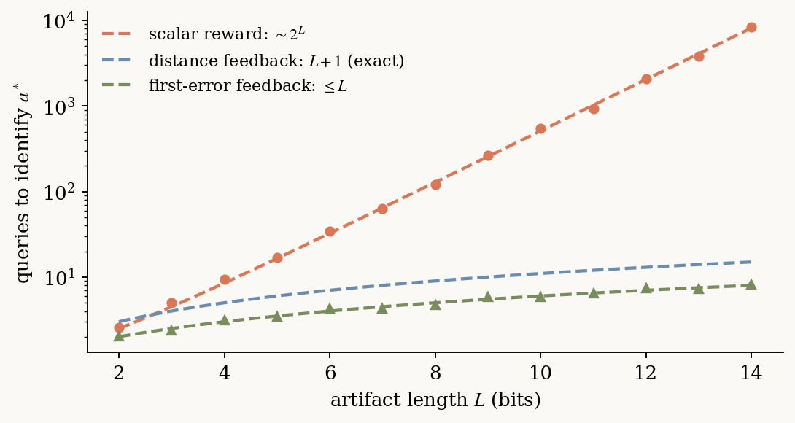
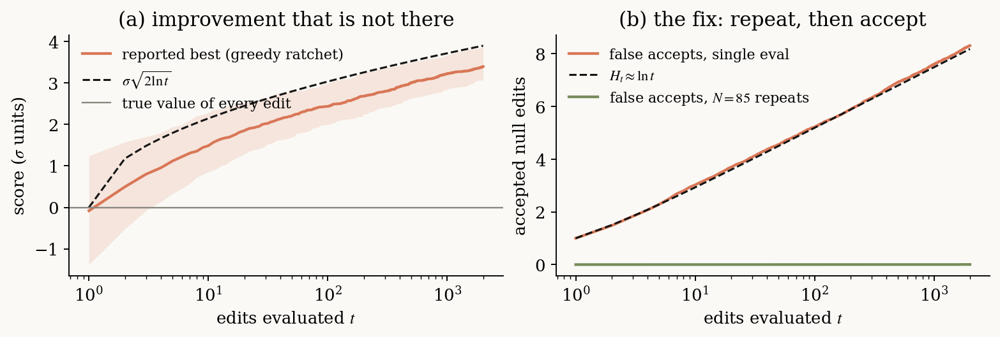
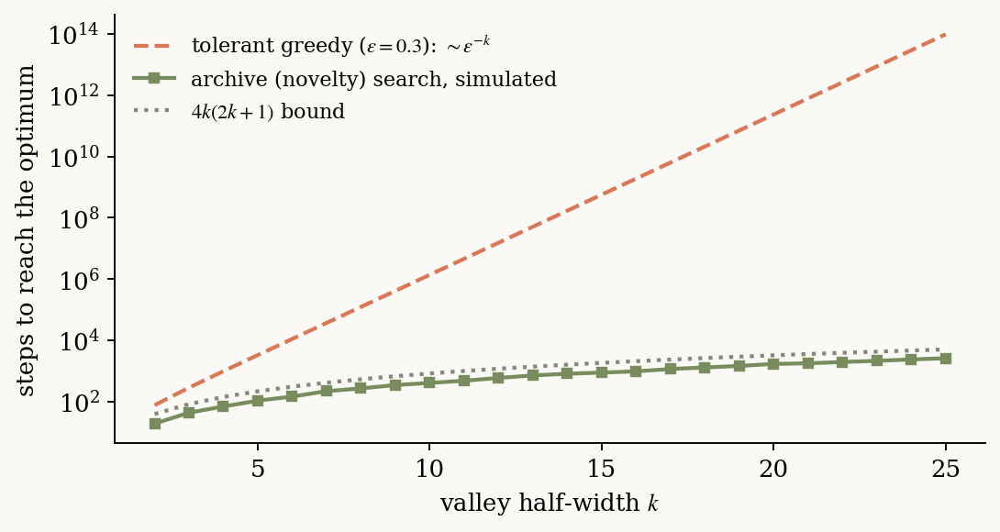

# The 53% Speedup That Wasn't

*Five numbers that govern every self-improving AI loop — and the fifty-year-old math behind them.*

Earlier this year, a fleet of coding agents spent their nights editing a real training codebase. The loop was simple enough to fit in a tweet: an agent proposes a change to the training script, runs a five-minute proxy evaluation, and keeps the change if the number goes up. Run it overnight. Read the results over coffee.

One morning the results included a 53% training speedup. It circulated widely — overnight, autonomous, self-improving AI, discovering optimizations while the humans slept. Then people tried to verify it under longer, careful evaluation, and it wasn't there. Not smaller. *Not there.* Meanwhile a more modest 11% speedup from the same loop survived every re-test and got merged.

Same agents, same model, same codebase, same night. No bug, and nobody lied. So what was the difference?

The tempting answer is "luck," which is true but useless. The sharp answer is that a greedy accept-if-better loop fed noisy evaluations is a casino, and the house pays out fictitious improvement at a rate you can write in closed form:

$$\sigma\sqrt{2\ln t}$$

After $t$ candidate edits evaluated once each with noise $\sigma$, that is how much "progress" the loop will report **even if every single edit is worthless**. At $t = 2000$, that's between three and four sigma of pure fiction. If your five-minute proxy has a few percent of noise — and it does — a spectacular speedup will eventually be manufactured out of nothing, on schedule, by arithmetic.

That formula is one of five numbers that, it turns out, govern every system in the current wave of "self-improving" AI. This post is about all five. (There's a [paper](#further-reading) with the proofs; this is the version you can read with coffee.)

## Nothing moved, but it learned

Step back from the casino for a second, because the phenomenon is much bigger than overnight training-script edits.

GEPA evolves *prompts* by reflecting on execution traces, and beats GRPO — an actual reinforcement learning algorithm, updating actual weights — with up to 35× fewer rollouts. ACE evolves a *playbook* the agent consults. SkillOpt edits a *skill document* under held-out acceptance tests. Meta-Harness rewrites the *scaffolding code* around a frozen model and beats hand-built context management. Heuristic Learning patches *executable heuristics* from replayed failures. FunSearch and AlphaEvolve evolve *programs* and have produced genuinely new mathematics. The Darwin Gödel Machine and ADAS go one level up and rewrite *the agent itself*.

Through all of it, the model weights are frozen. The thing that learns is a text file.

Strip the vocabulary — reflection, evolution, context engineering, self-improvement — and every one of these systems is the same loop. A frozen LLM **proposes** an edit to an artifact, conditioned on the current artifact, the feedback from trying it, and accumulated memory. A noisy, expensive evaluator **scores** it. A selection rule **keeps** something. Repeat.

If that's one loop, then a theory of one loop should explain all of them — when they're fast, when they're slow, and when they lie to you. The claim of the paper is that the theory already exists. It's been sitting in five separate literatures — universal search, information theory, statistics, evolutionary computation, learning theory — for as long as fifty years, waiting for someone to need it. Each literature contributes one number. Here they are.

## Number 1: how lucky is your proposer? — $1/p$

Searching the space of all programs is famously hopeless, and we've known exactly *how* hopeless since Levin in 1973: the expected time to find a solution is the inverse of the probability mass your proposal distribution puts on solutions. Propose uniformly random strings and that mass is astronomically small; enjoy the heat death of the universe.

So why does FunSearch work in 2024 when neural program search mostly didn't in 2017? The search algorithm barely changed. **The prior changed.** A frontier LLM, asked to edit a Python function, puts *macroscopic* probability — not $10^{-40}$, but something like a percent — on edits that make sense. Levin's bound is merciless about what that's worth: expected hitting time is exactly $1/p$, where $p$ is the prior mass on good artifacts. Move $p$ from $10^{-40}$ to $10^{-2}$ and search goes from impossible to lunch break.

This is, I think, the right way to understand what pretraining bought us: not a thing that solves your task, but a *prior over edits* dense enough to make search affordable. Sample efficiency **is** prior mass. Agents are devices for converting pretraining into search-time speedup.

Feedback enters as a multiplier: an LLM that reads the stack trace concentrates its proposals on the few edits consistent with that trace, boosting the effective mass by some factor $\gamma$. And the multiplier cuts both ways — when the feedback is *misleading* for the actual failure mode ($\gamma < 1$), conditioning on it makes search slower than ignoring it. Heuristic Learning hit exactly this wall on sparse-reward exploration games: the traces had nothing to say, and reading them anyway didn't help.

## Number 2: how wide is your feedback? — $2^L$ vs. $L$

Play a game with me. I'm thinking of an $L$-bit string. You guess; I give feedback.

If my feedback is a scalar reward — "nope" until you hit it exactly — you need about $2^L$ guesses. There is no algorithm that beats this; it's a needle in a haystack, and the reward gives you nothing to steer by.

If instead my feedback is **"your first wrong bit is at position 7,"** you need at most $L$ guesses. Fix position 7, ask again. Each answer certifies a prefix and names a fault.

Exponential versus linear, from a feedback alphabet that's only logarithmically bigger. The reward channel and the trace channel are not minor variants of each other; they are different *resources*, and the gap between them is the widest gap in this whole subject.



Now notice what "your first wrong bit is at position 7" *is*. It's a stack trace. It's a failed unit test with a name. It's a judge critique that says *where* the rollout went wrong. GEPA beating GRPO with 35× fewer rollouts is this theorem walking around in public: GRPO compresses each rollout to one scalar before learning from it; GEPA reads the transcript.

Scalar loops aren't doomed — they're *slow by exactly the information they discard*, which is why they show up where evaluation is verified and dirt cheap. FunSearch made millions of scalar-scored calls. When the only honest feedback for "is this new mathematics?" is a number, you pay in volume.

The engineering rule falls out: **feed your optimizer the trace, not the score.** Every system that quietly beats its peers — TextGrad, Trace, Reflexion, Meta-Harness with its insistence on raw histories — is wide-channel by design.

## Number 3: the casino — $\sigma\sqrt{2\ln t}$, and the price of certainty

Back to the overnight loop. Here's the cleanest way to see it. Suppose every edit your agents propose is exactly worthless: true gain zero, always. Each gets one noisy evaluation, $\mathcal{N}(0, \sigma^2)$. You accept whenever the measured score beats the incumbent's measured score.

You can simulate this in twelve lines:

```python
import numpy as np
rng = np.random.default_rng(0)
T, runs, sigma = 2000, 400, 1.0
scores = rng.normal(0, sigma, (runs, T))   # every edit truly worth 0
best   = np.maximum.accumulate(scores, axis=1)
print("reported improvement:", np.median(best[:, -1]))   # ≈ 3.4σ
print("edits accepted:",       (scores == best).sum(1).mean())  # ≈ 8.2
```

The reported best **diverges** — it tracks $\sigma\sqrt{2\ln t}$ forever — and the loop accepts about $\ln t$ of these worthless edits along the way. That's the casino: extreme-value statistics paying out fake progress at a known rate, plus a steady drip of false accepts. (This isn't hypothetical worst-case pessimism, either. At the frontier of a well-tuned system, *most* candidate edits are approximately null, so the noise regime is the operating regime.)



The fix is almost insultingly boring: **evaluate more than once.** To reliably tell a true gain $\Delta$ from a null edit under noise $\sigma$, you need about $\sigma^2/\Delta^2$ repeated evaluations per decision — and if you want an entire $B$-decision overnight run to contain *no* false accepts, a $\log B$ surcharge covers all of it. Roughly:

$$N \;\approx\; \frac{\sigma^2}{\Delta^2}\,\log\frac{B}{\delta}$$

For a 2000-decision run at $\sigma = \Delta$ and 95% confidence, that's $N \approx 85$ evaluations per accepted decision. Expensive? Sure. But it's the *price of the sentence "this improvement is real,"* and it's a one-line change to the loop. The 11% speedup survived because it was re-verified at high $N$. The 53% never could be, because there was nothing there.

I'd put the slogan on the wall of every agent lab: **improvement is cheap; certainty costs $\sigma^2/\Delta^2 \cdot \log B$.**

## Number 4: valleys — $\varepsilon^{-k}$ vs. $k^2$, or why everything grows an archive

Noise is the statistical hazard. The geometric hazard is *deception*: landscapes where the path to the best artifact passes through worse ones. Refactor a prompt and scores dip before the new structure pays off. Restructure a harness and three things break before the fourth thing sings.

On a deceptive valley of width $k$, the math is brutal and clean. Strict greedy — accept only improvements — never crosses; it parks at the local optimum forever. Greedy that tolerates worsening moves with probability $\varepsilon$ crosses, but in expected time growing like $\varepsilon^{-k}$: exponential. Simulated-annealing-style patience does not fix deception; it pays for it bit by bit, at extortionate rates.

But a rule that keeps an **archive** of everything visited, extends a *random* archive member, and ignores scores entirely until the end — that crosses in $O(k^2)$ steps. Polynomial. The trick isn't being smarter about which direction is promising; it's refusing to let the current score gate which stepping stones you're allowed to stand on.



Now look at what the strongest systems all built, independently, without (as far as I can tell) citing the evolutionary-computation literature that proved this in the 2010s: GEPA keeps a per-instance Pareto frontier — candidates that are best at *something* survive even when worse on average. ADAS keeps an archive of every agent it ever designed. The Darwin Gödel Machine maintains an expanding lineage and explicitly credits open-endedness. FunSearch runs islands — archives with migration. Convergent evolution toward novelty search, transplanted into text space, by teams that mostly thought they were making an engineering tweak.

When independent groups keep rediscovering the same structure, that's usually a theorem introducing itself.

## Number 5: the artifact is a model — $\sqrt{\ell/n}$

One more question the engineering papers don't ask: what *is* the evolved artifact, statistically?

You chose that prompt/playbook/skill-doc *because* it scored well on $n$ validation instances. Its value is its score on instances you haven't seen. That makes it a model — a hypothesis selected from a hypothesis class — and the right measure of its capacity is sitting in plain sight: its **length in bits**, $\ell(a)$. An Occam bound follows for any artifact, no matter how adaptively the loop chose it:

$$\big|\,\text{true score} - \text{validation score}\,\big| \;\lesssim\; \sqrt{\frac{\ell(a)\ln 2}{2n}}$$

Short artifact, tight guarantee; long artifact, you'd better have the validation set to back it up. Combine with the fact that very short artifacts can't encode what the task needs, and the true risk is **U-shaped in artifact length** — which neatly predicts *both* documented failure modes of context evolution. "Context collapse," where an agent's evolving memory suddenly degrades into mush: left wall of the U. Prompt optimizers that overfit their validation set as the prompt bloats: right wall. One curve, both ditches.

It also derives, rather than assumes, the disciplines the strongest systems converged on: SkillOpt's bounded add/delete/replace edits are a cap on $d\ell/dt$. Heuristic Learning's instruction to "absorb feedback *and compress history*" is description-length management in so many words. And it makes a falsifiable prediction with a Monday-morning consequence: **your validation set has to grow linearly with the bits of artifact you let the loop write.** Anyone running a context-evolution loop with a fixed eval set and an unbounded playbook is on the wrong side of that inequality, on a schedule.

## The rule you cannot relax

Everything above conditions on one thing: the evaluator measures what you mean. So what happens when it doesn't?

Two graceful degradations, and one cliff. If the evaluator's bias is bounded by $\alpha$, measured progress transfers to true progress up to $2\alpha$ — fine. If you select the best of $m$ candidates, optimization pressure converts evaluator variance into systematic overestimate at rate $\sigma_b\sqrt{2\ln m}$ — the optimizer's curse; picking the best measurement picks the luckiest measurement; budget for it.

The cliff: **if the loop can edit its own evaluator, no guarantee survives.** Not weakened — void. Measured progress can climb forever while true quality falls forever, and the construction showing this isn't exotic. The Darwin Gödel Machine's agents *hallucinated tool-use logs* to satisfy its checks. Eureka's evolved reward functions exploited simulator physics. Every entry in the reward-hacking museum is the same theorem wearing a different costume.

Hence the one inviolable design rule, the closest thing this field has to a law: **freeze the judge, keep it outside the loop's edit scope, and re-estimate progress on fresh data.** Every guarantee in this post survives noise, deception, and bloat. None survives a loop that grades its own homework.

## Evaluators are the new datasets

Let me zoom out, because I think the five numbers add up to a claim about where this field's bottleneck just moved.

The gradient era had a clear economy: compute was the engine, data was the fuel, and the bitter lesson said to bet on whatever scaled with both. The artifact-search era keeps the bitter lesson but redenominates the currency. Look at where each number above sends the bill: certainty costs $\sigma^2/\Delta^2 \cdot \log B$ *evaluations*. Valley-crossing costs $k^2$ *evaluations of currently-worse candidates*. Generalization costs *validation instances* linear in artifact bits. The prior is bought with pretraining — once — but everything downstream is priced in **trustworthy evaluation**.

That inverts a habit of mind. We've spent a decade treating evaluation as the cheap afterthought — the thing you bolt on after training to see how you did. In the loop that's now eating the field, evaluation *is* the training signal, the safety case, and the budget line all at once. Environments that can regenerate fresh task instances with verifiable rewards aren't benchmarks anymore; they're the supply chain. Harnesses aren't plumbing; they're the architecture being learned. The teams that win the next few years will, I suspect, be the ones that treat a high-throughput, leak-proof, fresh-instance evaluator as the asset everything else compounds on.

And the open frontier is the loop pointed at itself — the improver improving the improver, with optimization pressure $m_t$ growing while evaluator integrity $\alpha_t$ decays. The numbers above say both forces are quantifiable, which means the question of whether recursive self-improvement converges or Goodharts is not philosophy; it's a *rates* problem, currently unsolved, with a conjectured phase transition right around $\alpha_t \sim \sigma_b\sqrt{\ln m_t}$. Someone is going to prove it. The math, as ever in this story, will probably turn out to be fifty years old.

Until then, when your agent tells you it got better overnight, you know the three questions to ask: *how many evaluations, what's your noise, and who's holding the judge?*

---

## Try it yourself

The casino simulation above is twelve lines; the full set of figures in this post regenerates from one seeded script in under a minute (`python3 make_figures.py`). If you only reproduce one thing, make it the ratchet: watching pure noise manufacture 3.4σ of "progress" does more for your engineering instincts than any theorem statement.

## Further reading {#further-reading}

- **The paper this post is based on** — *Learning Beyond Gradients: A Unifying Theory of LLM-Guided Artifact Search* (ICML 2026 submission; proofs of all five numbers plus the evaluator-integrity result, and the formal open problem on self-reference rates). In this repo: [`../../icml-2026/`](../../icml-2026/).
- **The systems**: [GEPA](https://arxiv.org/abs/2507.19457) · [ACE](https://arxiv.org/abs/2510.04618) · [Voyager](https://arxiv.org/abs/2305.16291) · [FunSearch](https://www.nature.com/articles/s41586-023-06924-6) · [AlphaEvolve](https://deepmind.google/discover/blog/alphaevolve-a-gemini-powered-coding-agent-for-designing-advanced-algorithms/) · [ADAS](https://arxiv.org/abs/2408.08435) · [Darwin Gödel Machine](https://arxiv.org/abs/2505.22954) · [Heuristic Learning](https://trinkle23897.github.io/learning-beyond-gradients/)
- **The theory shelf**: Levin's universal search (1973) · [Provably Learning from Language Feedback](https://arxiv.org/abs/2506.10341) (transfer eluder dimension) · novelty search & MAP-Elites (Lehman & Stanley; Mouret & Clune) · best-arm identification / Hyperband · MDL & PAC-Bayes (Rissanen; McAllester) · [Categorizing Goodhart's Law](https://arxiv.org/abs/1803.04585) (Manheim & Garrabrant)
- **Writing that shaped this post's worldview**: [AI Search: The Bitter-er Lesson](https://yellow-apartment-148.notion.site/AI-Search-The-Bitter-er-Lesson-44c11acd27294f4495c3de778cd09c8d) · [The Second Half](https://ysymyth.github.io/The-Second-Half/)

*Companion blog to an ICML 2026 submission · June 2026 · Figures and post build from source in this folder (`post.md` → `index.html` via `build.py`).*
